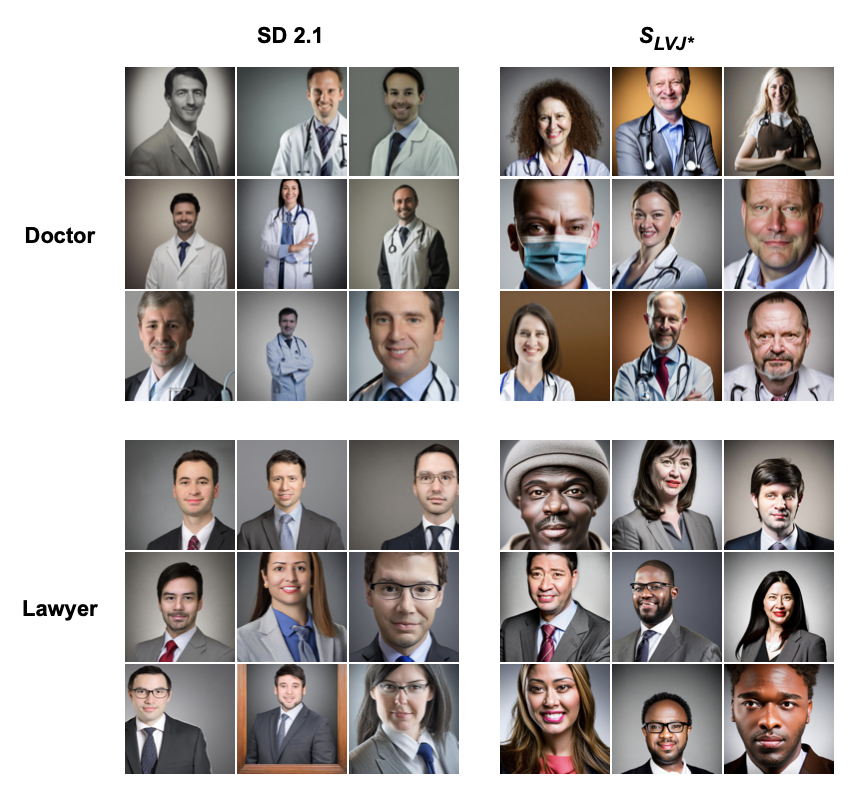

# Debiasing Text‐to‐Image Models via Data Augmentation and Contrastive Learning

This repository contains the code and methodology for the paper **"Debiasing Text‐to‐Image Models via Data Augmentation and Contrastive Learning."** In this work, we propose a novel approach to debias text-to-image models, specifically focusing on generating more diverse and accurate images of human occupations, by leveraging data augmentation and contrastive learning techniques.

---

<div align="center">
  
  <div style="clear: both;"></div>
</div> 
<p align="center"><em>Examples of image generation using our best SD 2.1 fine-tuned model. Images are generated using the prompt "Professional photo of a [occupation]". The occupation is shown at the left.</em></p>

---

## Prerequisites

Before you begin, make sure you have the following dependencies installed:

- Python 3.8+  
- PyTorch (version matching your CUDA setup)
- Transformers (for models and tokenization)
- PIL (for image processing)
- Numpy
- Matplotlib (optional for visualizations)

You can install the dependencies with the following commands for each step:

```bash
pip install -r finetune/requirements-prepare_dataset.txt
pip install -r finetune/requirements-finetune.txt
pip install -r evaluation/requirements-evaluation.txt
```

## Augmentation of the MPII Dataset

To fine-tune the model, we need to augment the MPII Human Pose dataset. Follow the steps below to download, load, label, and analyze the dataset.

### Downloading the Dataset

You can download the MPII Human Pose dataset from the official site by clicking the link below:

- [Download the MPII Human Pose Dataset](https://www.mpi-inf.mpg.de/departments/computer-vision-and-machine-learning/software-and-datasets/mpii-human-pose-dataset/download)

### Loading the Dataset

Once you have downloaded the dataset, you can load and preprocess it using the following script:

```bash
python mpii_dataset/load_dataset.py
```
This script will process and organize the dataset for use in training.

### Labeling the Dataset

To generate gender and race labels for the dataset, we provide a script to label the dataset with predicted demographic attributes. Run the following script to label the MPII dataset:

```bash
python generate_mpii_prediction_race.py
```

This script will apply gender and race prediction labels to the dataset, enabling bias analysis.


### Generating Dataset Analysis

After labeling the dataset, you can generate an analysis to inspect the dataset for any imbalances or biases. Run the following script to perform the analysis:

```bash
python dataset_analysis/analyze_dataset.py
```
## Generate the Enriched Dataset

Next, we will generate the enriched dataset needed for fine-tuning the model. This dataset contains positive, negative and anchor pairs that will be used during the contrastive learning process.

To generate this dataset, use the following script:

```bash
python finetune/prepare_dataset_finetune.py
```

## Finetune Stable Diffusion

Once the dataset has been prepared, we can fine-tune Stable Diffusion using different training strategies.

### Joint Training

For joint training of both the text encoder and the U-Net, run the following script:

```bash
python finetune/train_text_to_image_both.py
```

### Sequential Training

Alternatively, we can perform sequential training in multiple steps:

1. **Train the text encoder first**  
   ```bash
   python finetune/train_text_to_image_text.py
   ```

2. **Train the U-Net separately**  
   ```bash
   python finetune/train_text_to_image_unet.py
   ```

3. **Train both components together**  
   ```bash
   python finetune/train_text_to_image_both.py
   ```

To run the complete fine-tuning and evaluation process in a single step, use:
   ```bash
   python finetune/finetune_sd.py
   ```

## Evaluate Fine-tuned Model Using Our Method
Once the model has been fine-tuned, we evaluate its performance based on bias and image quality.

### Generate Evaluation Dataset
To generate prompts and images for evaluation, run:
```bash
python evaluation/generate_prompts.py
python evaluation/generate_images.py
```

### DeepFace Analyze - Compute Bias
To analyze potential biases in the generated images, use DeepFace:
```bash
python evaluate_bias.py
```

### Quality Evaluation
To assess the overall image quality and compare results quantitatively, run:

```bash
python quality_evaluation/compute_metrics.py
```

## Sota Evaluation

To compare our fine-tuned model with state-of-the-art (SOTA) models, we perform a thorough evaluation using the following scripts.

### Generate Images with SOTA Models

To generate images using pre-trained SOTA models, run:

```bash
python sota_evaluation/gen-images.py
```

### Evaluate the Generated Images
To analyze the generated images and compare results, use:

```bash
python sota_evaluation/eval-generated-images.py
```

### Compute Standard Metrics
For a quantitative comparison of model performance, run:

```bash
python sota_evaluation/compute_metrics.py
```

### Compute CLIP-based Similarity
To evaluate the alignment of generated images with textual prompts using CLIP, execute:

```bash
python sota_evaluation/compute_CLIP.py
```
